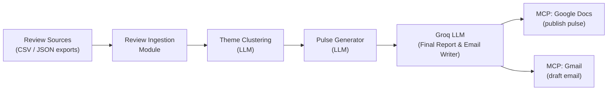
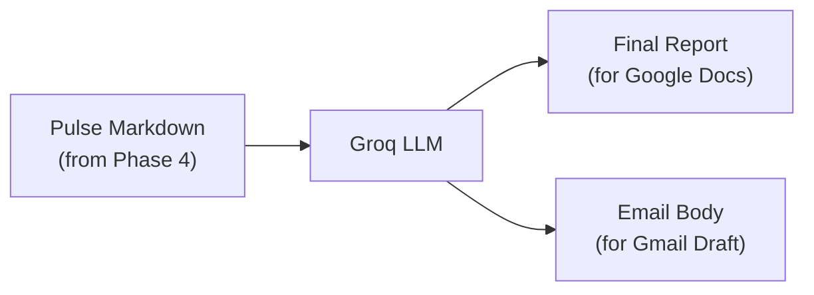
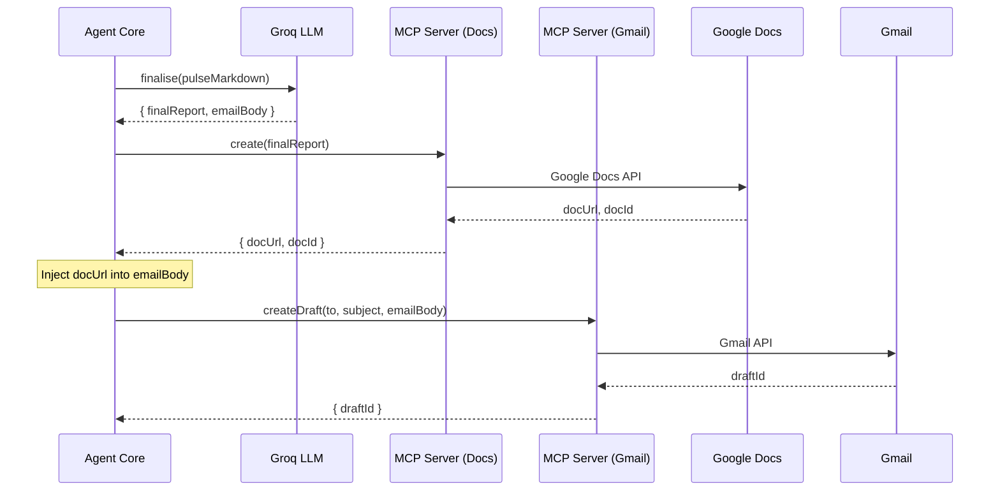
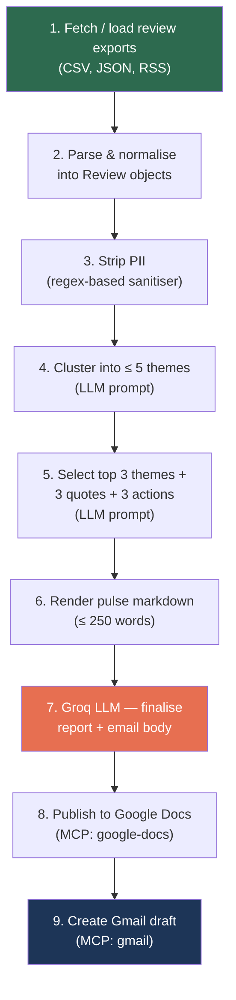

# Architecture — Weekly App Review Pulse

> Derived from [problemStatement.md](file:///c:/Users/rparv/.antigravity-ide/AI%20agent%20milestone%20-%203/docs/problemStatement.md)

---

## 1. System Overview

The system is an **AI-powered agent pipeline** that:

1. Ingests public mobile-app reviews (App Store & Play Store).
2. Clusters them into ≤ 5 themes using an LLM.
3. Generates a scannable weekly pulse (≤ 250 words).
4. **Finalises the report and email body using Groq LLM** — polished, stakeholder-ready prose.
5. Publishes the pulse to **Google Docs** and creates a **Gmail draft** — both via **MCP servers**.



---

## 2. High-Level Architecture

```mermaid
graph TD
    subgraph Data Layer
        R1["App Store Reviews\n(public export / RSS)"]
        R2["Play Store Reviews\n(public CSV export)"]
    end

    subgraph Agent Core
        IN["Review Ingester"]
        CL["Theme Clusterer"]
        PG["Pulse Generator"]
        PII["PII Stripper"]
    end

    subgraph Finalisation Layer – Groq
        GF["Groq LLM\nFinal Report & Email Writer"]
    end

    subgraph Integration Layer – MCP
        MCP_DOCS["MCP Server\nGoogle Docs"]
        MCP_GMAIL["MCP Server\nGmail"]
    end

    subgraph Outputs
        DOC["Google Doc\n(Weekly Pulse)"]
        EMAIL["Gmail Draft\n(with link / inline note)"]
    end

    R1 --> IN
    R2 --> IN
    IN --> PII
    PII --> CL
    CL --> PG
    PG --> GF
    GF --> MCP_DOCS --> DOC
    GF --> MCP_GMAIL --> EMAIL
```

---

## 3. Component Design

### 3.1 Review Ingestion Module

| Responsibility | Details |
|---|---|
| **Input** | Public review exports — CSV files (Play Store via Google Play Console export) and/or JSON/RSS feeds (App Store via public RSS endpoint). |
| **Window** | Last **8–12 weeks** of reviews. |
| **Fields extracted** | `rating`, `title`, `text`, `date`, `source` (App Store / Play Store). |
| **Output** | Normalised array of review objects stored in-memory (or as intermediate JSON). |

> [!IMPORTANT]
> Only public exports are allowed. No scraping behind store logins or ToS-violating automation.

#### Data Model — Review

```json
{
  "id": "uuid-v4",
  "source": "app_store | play_store",
  "rating": 4,
  "title": "Great app but slow transfers",
  "text": "I love the UI but transfers take forever...",
  "date": "2026-06-15",
  "weekLabel": "2026-W24"
}
```

---

### 3.2 PII Stripper

Runs **before** any LLM processing or storage.

| Rule | Action |
|---|---|
| Usernames / display names | Remove or replace with `[user]`. |
| Email addresses | Regex strip → `[email]`. |
| Device IDs / serial numbers | Regex strip → `[device]`. |
| Phone numbers | Regex strip → `[phone]`. |

Implementation: A dedicated utility function (`stripPII(text)`) applied to every review's `title` and `text` fields immediately after ingestion.

---

### 3.3 Theme Clustering Module

| Responsibility | Details |
|---|---|
| **Input** | Array of sanitised review objects. |
| **Method** | LLM-based semantic clustering — send all review texts (or representative samples if volume is very high) to the LLM with a prompt that asks it to identify ≤ 5 recurring themes. |
| **Output** | A `ThemeMap` — each theme has a label, a description, a review count, and the list of associated review IDs. |
| **Constraint** | **Maximum 5 themes**. |

#### Data Model — ThemeMap

```json
{
  "themes": [
    {
      "label": "Slow Transfers",
      "description": "Users report transfers taking too long.",
      "reviewCount": 42,
      "representativeQuotes": [
        "Transfers take forever, even small amounts...",
        "Why does a simple transfer need 3 business days?"
      ],
      "reviewIds": ["uuid-1", "uuid-2"]
    }
  ]
}
```

---

### 3.4 Pulse Generator Module

Takes the `ThemeMap` and produces the **weekly pulse document**.

#### Pulse Structure (≤ 250 words)

```
# Weekly App Review Pulse — Week of <date>

## Top Themes
1. <Theme A> — <one-liner>
2. <Theme B> — <one-liner>
3. <Theme C> — <one-liner>

## What Users Are Saying
> "<verbatim quote 1>" — <source>, <star rating>
> "<verbatim quote 2>" — <source>, <star rating>
> "<verbatim quote 3>" — <source>, <star rating>

## Recommended Actions
1. <Action idea grounded in Theme A>
2. <Action idea grounded in Theme B>
3. <Action idea grounded in Theme C>
```

| Rule | Enforcement |
|---|---|
| Top **3** themes only | Select by highest review count from the ThemeMap. |
| **3** verbatim quotes | Pulled from `representativeQuotes`; no invented wording. |
| **3** action ideas | LLM-generated, each tied to a specific theme. |
| **≤ 250 words** | Post-generation word-count check; re-prompt if exceeded. |
| **No PII** | Already stripped upstream; double-check at output. |

---

### 3.5 Groq LLM — Final Report & Email Writer

After the Pulse Generator produces the structured weekly note, the **Groq LLM** refines it into two polished, stakeholder-ready outputs:

| Output | Purpose | Details |
|---|---|---|
| **Final Report** | Google Docs content | Takes the raw pulse markdown and rewrites it into a professional, well-formatted report suitable for stakeholders. Preserves all verbatim quotes and data, but improves readability, tone, and structure. |
| **Email Body** | Gmail draft content | Produces a concise, action-oriented email that summarises the pulse highlights and includes a link to the full Google Doc. Tone: friendly-professional, scannable. |

> [!NOTE]
> Groq is used here for its **speed** (low-latency inference) — the final writing step benefits from fast turnaround since the analytical heavy-lifting (clustering, theme extraction) is already done.

| Responsibility | Details |
|---|---|
| **Input** | Raw pulse markdown (from Pulse Generator) + `docUrl` placeholder for the email body. |
| **LLM Provider** | Groq (`groq-sdk`) with a fast model (e.g., `llama-3.3-70b-versatile` or `mixtral-8x7b-32768`). |
| **Output** | `{ finalReport: string, emailBody: string }` — both ready for direct use by the MCP layer. |
| **Constraints** | Report ≤ 250 words; email ≤ 150 words. No PII. Quotes remain verbatim. |

#### Data Flow



Implementation: `src/generation/groqFinaliser.js`

---

### 3.6 MCP Integration Layer

> [!NOTE]
> All Google Workspace interactions go through **MCP servers** — no direct OAuth client or REST API code.

#### 3.6.1 Google Docs MCP

| Operation | MCP Tool Call | Details |
|---|---|---|
| **Create** pulse doc | `google-docs/create` | Creates a new Google Doc with the pulse content. |
| **Update** existing doc | `google-docs/update` | Appends or replaces content in an existing pulse doc (for recurring weekly updates). |
| **Read** doc ID | `google-docs/get` | Retrieve doc URL / ID to embed in the email draft. |

#### 3.6.2 Gmail MCP

| Operation | MCP Tool Call | Details |
|---|---|---|
| **Create draft** | `gmail/create-draft` | Creates a draft email addressed to self (or alias) containing the pulse inline **and** a link to the Google Doc. |

#### MCP Communication Model



---

## 4. Data Flow — End to End



---

## 5. Technology Stack

| Layer | Technology | Rationale |
|---|---|---|
| **Runtime** | Node.js (≥ 18) | Async-friendly; rich MCP client ecosystem. |
| **Language** | JavaScript / TypeScript | Matches MCP SDK tooling. |
| **LLM (Analysis)** | Gemini API (or OpenAI-compatible) | Theme clustering + pulse generation. |
| **LLM (Finalisation)** | **Groq** (`groq-sdk`) — e.g., `llama-3.3-70b-versatile` | Fast final report & email body writing. Low-latency inference. |
| **MCP Client** | `@modelcontextprotocol/sdk` | Standard MCP client for calling Docs & Gmail servers. |
| **MCP Servers** | Community / course-provided Google Docs & Gmail MCP servers | Auth & API abstracted away. |
| **Data format** | JSON (intermediate) | Lightweight interchange between pipeline stages. |
| **PII stripping** | Custom regex utility | Fast, deterministic, no external dependency. |

---

## 6. Proposed Directory Structure

```
project-root/
├── docs/
│   ├── problemStatement.md        # Requirements
│   ├── problemStatement.txt       # Original requirements (plain text)
│   └── architecture.md            # This document
│
├── src/
│   ├── index.js                   # Entry point — orchestrates the pipeline
│   │
│   ├── ingestion/
│   │   ├── appStoreIngester.js    # Parses App Store review exports
│   │   ├── playStoreIngester.js   # Parses Play Store CSV exports
│   │   └── reviewNormaliser.js    # Unifies into common Review schema
│   │
│   ├── privacy/
│   │   └── piiStripper.js         # Regex-based PII removal
│   │
│   ├── analysis/
│   │   └── themeClustering.js     # LLM-powered theme extraction (≤ 5)
│   │
│   ├── generation/
│   │   ├── pulseGenerator.js      # Produces the ≤ 250-word weekly note
│   │   └── groqFinaliser.js       # Groq LLM — polishes report & email body
│   │
│   ├── integrations/
│   │   ├── mcpClient.js           # Shared MCP client setup & helpers
│   │   ├── docsPublisher.js       # Google Docs via MCP
│   │   └── gmailDrafter.js        # Gmail draft via MCP
│   │
│   └── utils/
│       ├── dateHelpers.js         # Week labelling, date range logic
│       └── wordCount.js           # Enforce ≤ 250-word constraint
│
├── data/
│   └── reviews/                   # Drop review export files here
│       ├── appstore_reviews.json
│       └── playstore_reviews.csv
│
├── config/
│   └── mcp.json                   # MCP server endpoints & auth tokens
│
├── .env                           # API keys (LLM, MCP auth — gitignored)
├── .gitignore
├── package.json
└── README.md
```

---

## 7. Configuration & Environment

| Variable | Purpose | Example |
|---|---|---|
| `LLM_API_KEY` | API key for the analysis LLM provider | `sk-...` or Gemini key |
| `LLM_MODEL` | Analysis model identifier | `gemini-2.0-flash` |
| `GROQ_API_KEY` | API key for Groq (final report & email writing) | `gsk_...` |
| `GROQ_MODEL` | Groq model identifier | `llama-3.3-70b-versatile` |
| `MCP_DOCS_ENDPOINT` | URL of the Google Docs MCP server | `http://localhost:3001` |
| `MCP_GMAIL_ENDPOINT` | URL of the Gmail MCP server | `http://localhost:3002` |
| `PULSE_RECIPIENT` | Email for the Gmail draft | `team@example.com` |
| `REVIEW_WINDOW_WEEKS` | How many weeks of reviews to import | `10` |

---

## 8. Error Handling Strategy

| Failure Point | Mitigation |
|---|---|
| Review file missing or malformed | Log warning, skip bad rows, continue with valid reviews. Fail if zero valid reviews. |
| LLM rate-limit / timeout | Retry with exponential backoff (max 3 retries). |
| LLM returns > 5 themes | Re-prompt with stricter instruction; truncate if still exceeded. |
| Pulse exceeds 250 words | Re-prompt LLM requesting tighter language; hard-truncate as last resort. |
| Groq API rate-limit / timeout | Retry with backoff (max 3); fall back to using raw pulse markdown without Groq polishing. |
| Groq alters verbatim quotes | Post-Groq validation: compare quotes in output against source `representativeQuotes`. |
| MCP server unreachable | Retry once; fall back to saving pulse as local file + console warning. |
| PII detected in output | Final regex scan on generated pulse; redact any matches before publishing. |

---

## 9. Security & Privacy

- **PII stripping** is applied at ingestion (before LLM sees the data) **and** validated again at the output stage.
- **No credentials in code** — all secrets live in `.env` (gitignored).
- **MCP-first** means the agent never handles raw Google OAuth tokens; the MCP servers own that lifecycle.
- Review data is processed in-memory and not persisted beyond the pipeline run (source export files remain as-is).

---

## 10. Future Considerations

| Enhancement | Description |
|---|---|
| **Scheduled execution** | Cron / cloud scheduler to run the pipeline every Monday. |
| **Trend tracking** | Store weekly ThemeMaps in a database to visualise theme trends over time. |
| **Slack integration** | Post the pulse to a Slack channel via an additional MCP server. |
| **Sentiment scoring** | Add per-theme sentiment (positive / negative / neutral) via LLM. |
| **Multi-product support** | Parameterise the pipeline for multiple apps. |
