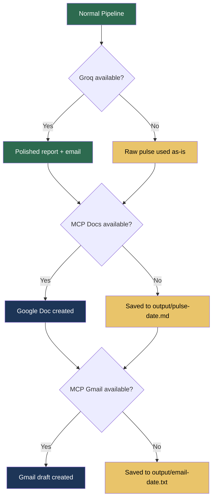

# Edge Cases & Corner Scenarios

> Companion to [architecture.md](file:///c:/Users/rparv/.antigravity-ide/AI%20agent%20milestone%20-%203/docs/architecture.md) and [implementation-plan.md](file:///c:/Users/rparv/.antigravity-ide/AI%20agent%20milestone%20-%203/docs/implementation-plan.md)

This document catalogues edge cases and corner scenarios across every pipeline phase, along with the expected behaviour and recommended handling strategy.

---

## 1. Review Ingestion

### 1.1 Empty or Missing Export Files

| Scenario | Expected Behaviour |
|---|---|
| CSV / JSON file is completely empty (0 bytes) | Log error: `"Review file is empty: {filename}"`. Skip file. Continue with other sources. |
| File path in config does not exist | Log error: `"File not found: {path}"`. Continue with remaining sources. |
| Both App Store and Play Store files are missing | **Abort pipeline** with a clear error: `"No review sources found. Provide at least one export file."` |

### 1.2 Malformed Data

| Scenario | Expected Behaviour |
|---|---|
| CSV has missing columns (e.g., no `rating` field) | Parse what's available; set missing fields to `null`. Log warning: `"Missing field 'rating' in {n} rows"`. |
| CSV contains extra/unexpected columns | Ignore extra columns silently. Only extract known fields. |
| JSON is syntactically invalid (broken JSON) | Catch parse error. Log error: `"Invalid JSON in {filename}"`. Skip file entirely. |
| CSV row has mismatched column count | Skip the malformed row. Log warning with row number. Continue parsing. |
| Date field is unparseable (e.g., `"N/A"`, `""`, `"32/13/2026"`) | Set `date` to `null` and `weekLabel` to `"unknown"`. Include the review but log a warning. |
| Rating is out of expected range (e.g., `0`, `6`, `-1`, `"five"`) | Clamp numeric values to 1–5. If non-numeric, set to `null`. Log warning. |
| Review text is empty or whitespace-only | **Exclude** the review — it provides no value for theme clustering. Log: `"Skipped {n} reviews with empty text"`. |
| Duplicate reviews (same text + date + source) | Deduplicate by content hash. Keep the first occurrence. Log: `"Removed {n} duplicate reviews"`. |

### 1.3 Date Window Filtering

| Scenario | Expected Behaviour |
|---|---|
| All reviews are older than the configured window | **Abort pipeline**: `"No reviews within the last {REVIEW_WINDOW_WEEKS} weeks. Check your export files."` |
| Some reviews have `null` dates | Include them (they may still be recent), but log: `"Including {n} reviews with unknown dates"`. |
| Export contains reviews from multiple years | Filter normally. The date window handles this — only last 8–12 weeks pass through. |

### 1.4 Volume Extremes

| Scenario | Expected Behaviour |
|---|---|
| Only 1–2 reviews in the window | Proceed, but warn: `"Very low review volume ({n} reviews) — themes may not be meaningful."` Pulse should still generate. |
| 10,000+ reviews | Batch for LLM processing. Send a representative sample (e.g., 500 reviews stratified by rating) to avoid token limits. Log: `"Sampled {n} of {total} reviews for clustering"`. |
| Reviews from only one source (e.g., Play Store only) | Proceed normally. Log: `"Reviews from single source: {source}"`. The `source` field will be uniform in the pulse. |

---

## 2. PII Stripping

### 2.1 False Positives

| Scenario | Expected Behaviour |
|---|---|
| Product name looks like an email (e.g., `pay@app`) | May be incorrectly stripped. **Accept** the false positive — privacy over precision. Log if a known product name is detected. |
| Review mentions a public figure by name | PII stripper does **not** catch proper names (no NER). This is an accepted limitation. Document it. |
| Hex string in review is actually a transaction ID, not a device ID | Strip it (`[device]`). Over-redaction is safer than under-redaction. |
| Phone number embedded in continuous text (e.g., `"call1234567890please"`) | Regex may miss it. Use word-boundary-aware patterns where possible. Accept some misses. |

### 2.2 False Negatives

| Scenario | Expected Behaviour |
|---|---|
| Email in non-standard format (e.g., `user [at] domain [dot] com`) | Will not be caught by standard regex. **Accept** — cover the 95% case. |
| PII in non-Latin scripts | Regex patterns are Latin-focused. Log a warning if non-Latin text is detected; flag for manual review. |

### 2.3 Over-Stripping

| Scenario | Expected Behaviour |
|---|---|
| Entire review text is stripped (everything matched a PII pattern) | Review becomes empty after stripping → **exclude it** from clustering. Log: `"Review {id} fully redacted — excluded"`. |
| Stripping removes meaning-bearing words | Accept. Quote may be less readable but remains private. The pulse generator can skip badly-redacted quotes. |

---

## 3. Theme Clustering (LLM)

### 3.1 LLM Response Issues

| Scenario | Expected Behaviour |
|---|---|
| LLM returns > 5 themes | Re-prompt once: `"You returned {n} themes. Consolidate into at most 5."`. If still > 5, take the top 5 by review count. |
| LLM returns 0 themes | Re-prompt once. If still 0, **abort pipeline**: `"LLM could not identify any themes from the reviews."` |
| LLM returns exactly 1 theme | Proceed. Pulse will have 1 theme instead of 3. Log: `"Only 1 theme identified — pulse will have limited content."` |
| LLM returns 2 themes | Proceed. Pulse top themes section will list 2 instead of 3. |
| LLM response is not valid JSON | Retry up to 3 times with the same prompt. If all fail, try a fallback prompt with stricter JSON instructions. If still failing, abort with error. |
| LLM returns JSON but with wrong schema (missing fields) | Validate against expected schema. Fill missing fields with defaults where safe (`reviewCount: 0`, `representativeQuotes: []`). Log warnings. |
| LLM hallucinates quotes (text not in any review) | **Post-processing check**: fuzzy-match each quote against the source reviews. If similarity < 80%, replace with the closest real review text. Log: `"Replaced {n} hallucinated quotes"`. |

### 3.2 Content Edge Cases

| Scenario | Expected Behaviour |
|---|---|
| All reviews are 5-star with generic praise ("Great app!") | LLM may produce a single vague theme. Accept. Pulse reflects reality — the app is doing well. |
| All reviews are 1-star with the same complaint | LLM should produce 1 dominant theme. Pulse highlights this single critical issue. |
| Reviews are in multiple languages | LLM should handle multilingual input. If the primary language is English, non-English reviews may cluster poorly. Log: `"Detected {n} non-English reviews"`. Consider filtering or translating. |
| Reviews contain profanity / offensive language | Pass through to LLM. The pulse generator should produce a professional summary. Verbatim quotes should be selected from non-offensive reviews where possible. |
| Extremely short reviews ("Good", "Bad", "👍") | Include them. They contribute to rating distributions but may not produce meaningful quotes. LLM should not select these as representative quotes. |

### 3.3 Token Limits

| Scenario | Expected Behaviour |
|---|---|
| Total review text exceeds LLM context window | Truncate or sample reviews. Strategy: send the most recent 500 reviews, stratified by rating. Log: `"Truncated input to fit context window"`. |
| Single review is extremely long (>2000 words) | Truncate individual reviews to 500 words before sending to LLM. Log: `"Truncated {n} long reviews"`. |

---

## 4. Pulse Generation

### 4.1 Word Count Issues

| Scenario | Expected Behaviour |
|---|---|
| LLM generates pulse > 250 words | Re-prompt: `"The pulse is {n} words. Rewrite to be under 250 words while keeping all required sections."` Max 2 retries. If still over, hard-truncate at 250 words with `"..."` appended. |
| LLM generates pulse < 50 words | Too sparse. Re-prompt requesting more detail. If still under 50, accept — may indicate very few reviews. |
| Word count exactly at 250 | Accept. Boundary is inclusive. |

### 4.2 Structure Issues

| Scenario | Expected Behaviour |
|---|---|
| LLM omits a required section (e.g., no "Recommended Actions") | Detect missing section via regex/parsing. Re-prompt specifically requesting the missing section. |
| LLM outputs HTML instead of markdown | Strip HTML tags or convert to markdown. Log: `"Converted HTML output to markdown"`. |
| LLM includes numbered themes but wrong count (e.g., 4 instead of 3) | Trim to top 3 or pad with available themes. |
| Quotes in pulse don't match any source review | Same hallucination check as Phase 3. Replace with verified quotes. |

### 4.3 Date Handling

| Scenario | Expected Behaviour |
|---|---|
| Pipeline runs mid-week (not on a Monday) | Use the current ISO week number for the pulse title. Document: `"Week of {Monday date of current week}"`. |
| Pipeline runs on Jan 1 (week 1 / week 52 boundary) | Use ISO 8601 week numbering. Test this edge case explicitly. |

---

## 5. Groq LLM Finalisation

### 5.1 Groq API Issues

| Scenario | Expected Behaviour |
|---|---|
| Groq API key is invalid or expired | Catch 401 error. Log: `"Groq authentication failed"`. **Fall back** to using raw pulse markdown without polishing. Pipeline continues. |
| Groq API is completely down | Retry 3 times with exponential backoff (1s, 2s, 4s). If all fail, fall back to raw pulse. Log: `"Groq unavailable — using unpolished pulse"`. |
| Groq rate limit hit (429) | Respect `Retry-After` header. Wait and retry. If wait > 30s, fall back to raw pulse. |
| Groq returns empty response | Treat as failure. Retry once. If still empty, fall back. |
| Groq response is truncated (model hit max tokens) | Detect truncation (no closing markdown structure). Increase `max_tokens` and retry. If still truncated, use raw pulse. |

### 5.2 Content Quality Issues

| Scenario | Expected Behaviour |
|---|---|
| Groq rephrases verbatim quotes | **Critical violation**. Post-Groq check: compare each quote against source `representativeQuotes`. If any quote has < 95% character-level similarity, replace it with the original. Log: `"Groq altered {n} quotes — restored originals"`. |
| Groq adds information not in the source pulse | Detect by checking for theme labels or claims not present in the ThemeMap. Strip added content. Log warning. |
| Groq introduces PII (e.g., fabricates an email address) | Run PII stripper on Groq output as final safety net. |
| Groq final report exceeds 250 words | Re-prompt once. If still over, truncate. |
| Groq email body exceeds 150 words | Re-prompt once. If still over, truncate. |
| Groq email body missing `{docUrl}` placeholder | Detect via string search. Append `"\n\nFull report: {docUrl}"` to the email body. Log warning. |

### 5.3 Dual-Output Consistency

| Scenario | Expected Behaviour |
|---|---|
| Report and email body contradict each other (different top themes) | Both are generated from the same source pulse. If themes differ, regenerate the email body from the finalised report. |
| Groq returns report but fails on email (or vice versa) | Retry the failed output only. If still failing, use raw pulse for the failed piece. |

---

## 6. MCP Integration (Google Docs & Gmail)

### 6.1 Google Docs MCP

| Scenario | Expected Behaviour |
|---|---|
| MCP Docs server is unreachable | Retry once after 2s. If still down, save report to `output/pulse-{date}.md` locally. Log: `"Docs MCP unavailable — saved locally"`. Pipeline continues to Gmail step. |
| MCP Docs create call succeeds but returns no `docUrl` | Treat as failure. Retry once. If still no URL, save locally. Skip Gmail (can't link a doc that doesn't exist). |
| Google Doc creation succeeds but content is garbled | No automated detection. Rely on manual verification. Document as a known limitation. |
| Document title already exists in Google Drive | MCP should create a new doc regardless (Google Docs allows duplicate titles). No conflict. |
| Report content contains characters that break Google Docs formatting | Sanitise markdown before sending: escape special characters, remove unsupported markdown extensions. |

### 6.2 Gmail MCP

| Scenario | Expected Behaviour |
|---|---|
| MCP Gmail server is unreachable | Retry once. If still down, log: `"Gmail MCP unavailable — draft not created"`. Save email body to `output/email-{date}.txt` locally. |
| `PULSE_RECIPIENT` is empty or invalid | Validate email format before calling MCP. If invalid, log error. Use a fallback `"me"` (self-draft) if available. |
| Email body with `{docUrl}` placeholder but no docUrl available (Docs step failed) | Replace `{docUrl}` with `"[Document unavailable — see local file: output/pulse-{date}.md]"`. |
| Draft creation succeeds but draft doesn't appear in Gmail | MCP returned a `draftId` but Gmail API had a transient issue. No automated fix — log the `draftId` for debugging. |
| Email subject line contains special characters | Sanitise subject: strip newlines, limit to 150 chars, encode UTF-8 properly. |

### 6.3 MCP Server Configuration

| Scenario | Expected Behaviour |
|---|---|
| MCP server endpoints not configured in `.env` | Fail early at startup: `"Missing required env var: MCP_DOCS_ENDPOINT"`. Do not proceed to any pipeline phase. |
| MCP server is running but authentication is expired | Catch 401/403 from MCP. Log: `"MCP auth failed for {service}"`. Fall back to local output. |
| MCP server responds but tool name is wrong | Catch "tool not found" error. Log the available tools for debugging. Abort MCP step; fall back to local. |

---

## 7. Cross-Cutting Edge Cases

### 7.1 Environment & Configuration

| Scenario | Expected Behaviour |
|---|---|
| `.env` file is missing entirely | Crash with clear message: `"No .env file found. Copy .env.example to .env and fill in values."` |
| `LLM_API_KEY` is set but invalid | Catch on first LLM call (Phase 3). Abort: `"LLM authentication failed. Check LLM_API_KEY."` |
| `GROQ_API_KEY` is set but invalid | Catch on Groq call (Phase 5). Fall back to raw pulse. |
| `REVIEW_WINDOW_WEEKS` is set to `0` or negative | Clamp to minimum `1`. Log warning: `"Invalid REVIEW_WINDOW_WEEKS ({value}) — using 1"`. |
| `REVIEW_WINDOW_WEEKS` is extremely large (e.g., `520` = 10 years) | Accept. May return all reviews. Log: `"Large review window: {n} weeks"`. |

### 7.2 Concurrency & Timing

| Scenario | Expected Behaviour |
|---|---|
| Pipeline is run twice simultaneously | No shared state — each run is independent. Both may create separate Google Docs and Gmail drafts. Acceptable. |
| Pipeline runs at midnight (date boundary) | Use the date/time at pipeline **start** for all labels. Do not recompute mid-run. |
| System clock is incorrect | Dates will be wrong in pulse title and week labels. No automated fix. Document as a prerequisite: "Ensure system clock is correct." |

### 7.3 Output & File System

| Scenario | Expected Behaviour |
|---|---|
| `output/` directory doesn't exist (fallback path) | Create it automatically before writing. |
| Disk is full (can't write local fallback) | Catch write error. Log to console as last resort. Pipeline exits with error code. |
| Local fallback file already exists from a previous run | Overwrite with the latest pulse. Log: `"Overwriting previous fallback: {filename}"`. |

---

## 8. Edge Case Testing Matrix

A quick-reference checklist for verifying edge case coverage:

| # | Edge Case | Phase | Priority | Automated? |
|---|---|---|---|---|
| E01 | Both review files missing | 2 | 🔴 Critical | ✅ Yes |
| E02 | All reviews outside date window | 2 | 🔴 Critical | ✅ Yes |
| E03 | Malformed CSV rows | 2 | 🟡 Medium | ✅ Yes |
| E04 | Invalid JSON file | 2 | 🟡 Medium | ✅ Yes |
| E05 | Empty review text | 2 | 🟡 Medium | ✅ Yes |
| E06 | Duplicate reviews | 2 | 🟢 Low | ✅ Yes |
| E07 | PII false positive (product name stripped) | 2 | 🟢 Low | ⚠️ Partial |
| E08 | Full review redacted by PII stripper | 2 | 🟡 Medium | ✅ Yes |
| E09 | LLM returns > 5 themes | 3 | 🟡 Medium | ✅ Yes |
| E10 | LLM returns 0 themes | 3 | 🔴 Critical | ✅ Yes |
| E11 | LLM returns invalid JSON | 3 | 🟡 Medium | ✅ Yes |
| E12 | LLM hallucinates quotes | 3 | 🔴 Critical | ✅ Yes |
| E13 | Token limit exceeded | 3 | 🟡 Medium | ✅ Yes |
| E14 | Pulse > 250 words | 4 | 🟡 Medium | ✅ Yes |
| E15 | Missing pulse section | 4 | 🟡 Medium | ✅ Yes |
| E16 | Groq API down | 5 | 🟡 Medium | ✅ Yes |
| E17 | Groq alters verbatim quotes | 5 | 🔴 Critical | ✅ Yes |
| E18 | Groq email missing `{docUrl}` | 5 | 🟡 Medium | ✅ Yes |
| E19 | MCP Docs server unreachable | 6 | 🟡 Medium | ✅ Yes |
| E20 | MCP Gmail server unreachable | 6 | 🟡 Medium | ✅ Yes |
| E21 | `.env` missing | Setup | 🔴 Critical | ✅ Yes |
| E22 | Invalid API keys | 3 / 5 | 🔴 Critical | ✅ Yes |
| E23 | Only 1–2 reviews available | 2 | 🟡 Medium | ✅ Yes |
| E24 | 10,000+ reviews | 2 / 3 | 🟡 Medium | ⚠️ Partial |
| E25 | Non-English reviews | 3 | 🟢 Low | ❌ No |

---

## 9. Graceful Degradation Summary

The pipeline is designed to **degrade gracefully** rather than fail catastrophically. Here's the fallback chain:

> [!TIP]
> The pipeline should **always produce output** — even if all external services are down, the pulse is saved locally. The only hard abort conditions are: (1) zero review files found, (2) zero reviews within the date window, or (3) LLM cannot identify any themes.
