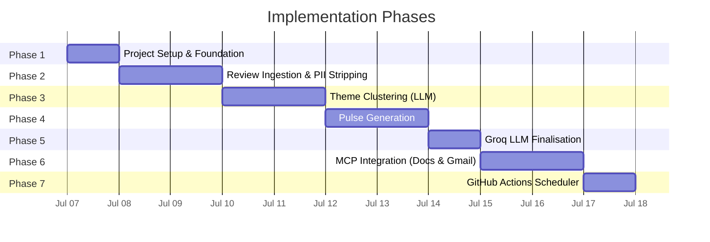
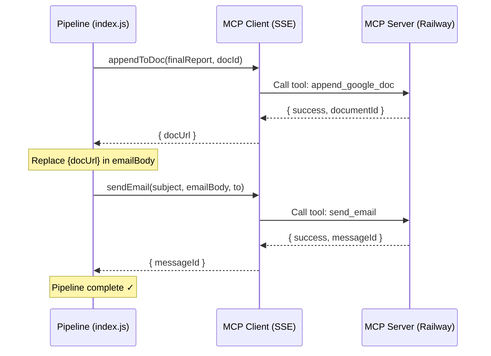
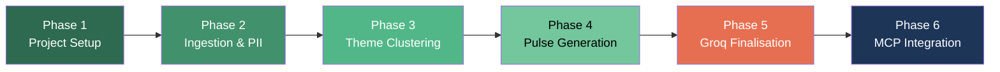

# Implementation Plan — Weekly App Review Pulse

> Derived from [architecture.md](file:///c:/Users/rparv/.antigravity-ide/AI%20agent%20milestone%20-%203/docs/architecture.md) and [problemStatement.md](file:///c:/Users/rparv/.antigravity-ide/AI%20agent%20milestone%20-%203/docs/problemStatement.md)

---

## Plan Overview

The implementation is divided into **6 phases**, ordered by dependency: foundation first, then data ingestion, AI analysis, output generation, **Groq LLM finalisation**, and finally MCP-based delivery. Each phase is self-contained and testable before moving to the next.



---

## Phase 1 — Project Setup & Foundation

**Goal:** Scaffold the project, install dependencies, set up configuration, and build shared utilities.

### Tasks

| # | Task | File(s) | Details |
|---|---|---|---|
| 1.1 | Initialise Node.js project | `package.json` | `npm init -y`; set `"type": "module"` for ESM. |
| 1.2 | Install core dependencies | `package.json` | `@google/generative-ai` (Gemini SDK), `@modelcontextprotocol/sdk`, `dotenv`, `csv-parse`. |
| 1.3 | Create directory structure | `src/`, `data/`, `config/`, `docs/` | Match the layout defined in [architecture.md § 6](file:///c:/Users/rparv/.antigravity-ide/AI%20agent%20milestone%20-%203/docs/architecture.md). |
| 1.4 | Set up environment config | `.env`, `.env.example`, `.gitignore` | Define `LLM_API_KEY`, `LLM_MODEL`, `MCP_DOCS_ENDPOINT`, `MCP_GMAIL_ENDPOINT`, `PULSE_RECIPIENT`, `REVIEW_WINDOW_WEEKS`. |
| 1.5 | Build date utilities | `src/utils/dateHelpers.js` | `getWeekLabel(date)` → `"2026-W24"`, `isWithinWindow(date, weeks)` → boolean. |
| 1.6 | Build word-count utility | `src/utils/wordCount.js` | `countWords(text)` → number, `isWithinLimit(text, max)` → boolean. |
| 1.7 | Create entry-point skeleton | `src/index.js` | Stub the pipeline stages with TODO comments; verify the project runs (`node src/index.js`). |

### Exit Criteria

- [x] `npm install` succeeds.
- [x] `node src/index.js` runs without errors (prints "Pipeline ready").
- [x] `.env.example` documents all required variables.
- [x] Utility functions pass manual smoke tests.

---

## Phase 2 — Review Ingestion & PII Stripping

**Goal:** Load review exports from files, normalise them into a common schema, apply quality filters, and strip all PII before downstream processing.

### Tasks

| # | Task | File(s) | Details |
|---|---|---|---|
| 2.1 | Build Play Store CSV ingester | `src/ingestion/playStoreIngester.js` | Parse CSV using `csv-parse`; extract `rating`, `title`, `text`, `date`. |
| 2.2 | Build App Store JSON ingester | `src/ingestion/appStoreIngester.js` | Parse JSON (or RSS-to-JSON); extract the same fields. |
| 2.3 | Build review normaliser | `src/ingestion/reviewNormaliser.js` | Merge both sources into a unified `Review[]` array with `id` (UUID), `source`, `rating`, `title`, `text`, `date`, `weekLabel`. |
| 2.4a | Filter by date window | `src/ingestion/reviewNormaliser.js` | Drop reviews older than `REVIEW_WINDOW_WEEKS` (default 10). |
| 2.4b | Apply quality filters | `src/ingestion/reviewNormaliser.js` | Remove reviews that are too short (<8 words), contain emoji, or are in Hindi. See **Quality Filters** below. |
| 2.5 | Build PII stripper | `src/privacy/piiStripper.js` | Regex patterns for emails, phone numbers, usernames, device IDs. Apply to `title` and `text`. |
| 2.6 | Integrate into pipeline | `src/index.js` | Wire ingestion → quality filtering → PII stripping; log summary (e.g., "Loaded 247 reviews from 2 sources"). |
| 2.7 | Add sample data | `data/reviews/` | Place sample `playstore_reviews.csv` and `appstore_reviews.json` for development & testing. |

### Data Model — Review Object

```json
{
  "id": "a3f1b2c4-...",
  "source": "play_store",
  "rating": 3,
  "title": "Good but buggy",
  "text": "The app crashes when I try to...",
  "date": "2026-06-10",
  "weekLabel": "2026-W24"
}
```

### Quality Filters (Task 2.4b)

Applied **after** deduplication and date filtering, **before** PII stripping:

| Filter | Rule | Rationale |
|---|---|---|
| **Short reviews** | Remove reviews where `text` has < 8 words | Too brief to contribute meaningful themes (e.g., "Good app", "Nice", "👍"). |
| **Emoji reviews** | Remove reviews where `text` contains any emoji characters | Emoji-heavy reviews (e.g., "🔥🔥🔥", "👎👎") are low-signal for text-based theme clustering. |
| **Hindi language** | Remove reviews where `text` contains Devanagari script characters (`\u0900-\u097F`) | Pipeline targets English-language analysis; Hindi reviews would cluster poorly and produce garbled themes. |

### PII Stripping Rules

| Pattern | Regex | Replacement |
|---|---|---|
| Email addresses | `/[a-zA-Z0-9._%+-]+@[a-zA-Z0-9.-]+\.[a-zA-Z]{2,}/g` | `[email]` |
| Phone numbers | `/(\+?\d{1,3}[-.\s]?)?\(?\d{2,4}\)?[-.\s]?\d{3,4}[-.\s]?\d{4}/g` | `[phone]` |
| Usernames (`@handle`) | `/@[a-zA-Z0-9_]{2,}/g` | `[user]` |
| Device IDs (hex 8+) | `/\b[A-Fa-f0-9]{8,}\b/g` | `[device]` |

### Exit Criteria

- [ ] CSV and JSON ingesters load sample data correctly.
- [ ] Normaliser produces a clean `Review[]` with all required fields.
- [ ] Date filter correctly excludes old reviews.
- [ ] Quality filters remove short (<8 words), emoji, and Hindi reviews.
- [ ] PII stripper removes test PII patterns without corrupting review text.
- [ ] Pipeline prints a summary of loaded, filtered, & sanitised reviews.

---

## Phase 3 — Theme Clustering via LLM

**Goal:** Send sanitised reviews to the LLM and receive ≤ 5 well-defined themes with sentiment breakdown, representative quotes, and actionability signals.

### Data Observations (from 69 real Groww reviews)

Before designing the analysis strategy, we studied the actual normalised review corpus:

| Observation | Impact on Strategy |
|---|---|
| **Romanised Hindi** still present (e.g., "bhut achha ap hai", "meto loss mehi hu") — Devanagari filter only catches Hindi script, not Latin-transliterated Hindi. | Add a **pre-LLM language filter** (Task 3.1) that uses a heuristic word-list to detect romanised Hindi/Hinglish. |
| **Tamil script** review found (line 304 of normalised data). Non-English is not limited to Hindi. | Extend the language filter to catch other Indic scripts (Tamil `\u0B80-\u0BFF`, Telugu `\u0C00-\u0C7F`, Kannada `\u0C80-\u0CFF`, etc.). |
| **69 reviews** — entire corpus fits within a single Gemini call (~4,000 tokens). No batching required. | Use a **single-pass prompt** strategy. No chunking/map-reduce overhead. |
| Many **5-star reviews are actually feature requests** (e.g., "add US stocks", "add Telugu language", "add kill switch"). Star rating ≠ sentiment. | LLM must classify **actual sentiment** (`positive`, `negative`, `mixed`, `feature_request`) independently of star rating. |
| **High-frequency signals** in the data: brokerage charges, app crashes/lags, customer support quality, Prime membership complaints, feature requests (OI, GTT, international markets). | Prompt should include **fintech-domain context** so the LLM groups these correctly rather than splitting them arbitrarily. |
| Some reviews mention **competitors** by name (Zerodha, IndMoney) — useful signal for competitive positioning. | Add a `competitorMentions` array to the ThemeMap. |

### Tasks

| # | Task | File(s) | Details |
|---|---|---|---|
| 3.1 | Pre-LLM language filter | `src/ingestion/reviewNormaliser.js` | Add romanised Hindi word-list detection and multi-script (Tamil, Telugu, Kannada, Bengali, Gujarati) regex filter. Apply during quality filter step. |
| 3.2 | Sentiment pre-classification | `src/analysis/themeClustering.js` | Before sending to LLM, compute a `sentimentHint` per review using star rating + keyword heuristics: `positive` (4-5★ + no negative keywords), `negative` (1-2★), `mixed` (3★ or contradictory signals), `feature_request` (contains "please add", "should have", "wish", etc.). Pass these hints to the LLM to improve accuracy. |
| 3.3 | Set up LLM client | `src/analysis/themeClustering.js` | Initialise `@google/generative-ai` with `LLM_API_KEY` and `LLM_MODEL`. Use `responseMimeType: 'application/json'` for structured output. |
| 3.4 | Design clustering prompt | `src/analysis/themeClustering.js` | Craft a **domain-aware prompt** (see Prompt Design below) that provides fintech context, instructs the LLM to cluster, and returns structured JSON. |
| 3.5 | Parse & validate LLM response | `src/analysis/themeClustering.js` | Extract the `ThemeMap` from JSON output; validate structure, enforce ≤ 5 themes, verify quotes exist in actual reviews (fuzzy match). |
| 3.6 | Handle edge cases | `src/analysis/themeClustering.js` | If > 5 themes → trim to top 5 by `reviewCount`. If malformed JSON → retry (max 3 with exponential backoff). If all quotes are hallucinated → replace with closest matching real reviews. |
| 3.7 | Integrate into pipeline | `src/index.js` | Wire: sanitised reviews → theme clustering; log discovered themes with sentiment breakdown. Save themes to `data/analysis/themes.json`. |

### Analysis Strategy — Single-Pass with Sentiment Context

```
┌──────────────────┐
│  69 sanitised     │
│  reviews          │
└────────┬─────────┘
         │
    ┌────▼────────────────┐
    │ 3.1 Language Filter  │  Remove romanised Hindi, Tamil, etc.
    │     (heuristic)      │  Output: ~55-60 English-only reviews
    └────────┬─────────────┘
         │
    ┌────▼────────────────┐
    │ 3.2 Sentiment Hints  │  Tag each review: positive/negative/mixed/feature_request
    │     (rule-based)     │  Uses rating + keyword matching
    └────────┬─────────────┘
         │
    ┌────▼────────────────────────────────────┐
    │ 3.3–3.5 Single Gemini Call               │
    │  - Send all reviews + sentiment hints    │
    │  - Request ≤5 themes with structured     │
    │    JSON output                           │
    │  - responseMimeType: application/json    │
    └────────┬─────────────────────────────────┘
         │
    ┌────▼────────────────┐
    │ 3.6 Validate & Fix   │  Trim themes, verify quotes, retry if needed
    └────────┬─────────────┘
         │
    ┌────▼────────────────┐
    │ 3.7 Save & Log       │  data/analysis/themes.json
    └──────────────────────┘
```

### Clustering Prompt Design

```
System:
You are a senior product analyst at a fintech company.
You are analysing user reviews of "Groww" — a stock trading and mutual fund
investment app available on the Google Play Store.

Context about this app:
- Groww is an Indian fintech platform for stocks, mutual funds, bonds, IPOs, and F&O trading.
- "Groww Prime" is their premium membership for mutual funds.
- "915 by Groww" is their stock analysis tool.
- Key competitors include Zerodha, Upstox, IndMoney, Angel One.
- Common user concerns include: brokerage charges, app stability during market
  hours, withdrawal speed, KYC process, customer support quality, and chart/UI quality.

TASK:
Given the following user reviews (each tagged with a sentiment hint),
identify the top recurring themes. Return AT MOST 5 themes.

For each theme provide:
- "label": short name (2-4 words)
- "sentiment": dominant sentiment of this theme ("positive", "negative", "mixed")
- "urgency": how urgently this needs attention ("critical", "high", "medium", "low")
- "description": one clear sentence explaining the theme
- "reviewCount": number of reviews related to this theme
- "representativeQuotes": exactly 3 verbatim quotes copied from the reviews (no edits)
- "actionInsight": one sentence suggesting what the product team should do

RULES:
- Quotes MUST be exact substrings from the provided reviews. Do not modify them.
- Sort themes by reviewCount descending.
- Do not create duplicate themes for the same underlying issue.
- If a review matches multiple themes, count it only in the most relevant one.

Return ONLY valid JSON:
{
  "themes": [...],
  "competitorMentions": ["Zerodha", ...],
  "overallSentiment": "mixed",
  "totalReviewsAnalysed": 69
}
```

### Data Model — ThemeMap (updated)

```json
{
  "themes": [
    {
      "label": "High Brokerage Charges",
      "sentiment": "negative",
      "urgency": "critical",
      "description": "Users complain about high brokerage fees, especially on F&O trades, eating into their profits.",
      "reviewCount": 15,
      "representativeQuotes": [
        "high brokerage fees....more than half the profit we make...ridiculous",
        "This app have high charges and when you try to talk to agent you will get no response",
        "TOO MUCH HIDDEN SCAMS!! For mutual fund investment only few direct plans are available"
      ],
      "actionInsight": "Benchmark brokerage against Zerodha and consider a tiered pricing model for active traders."
    }
  ],
  "competitorMentions": ["Zerodha", "IndMoney"],
  "overallSentiment": "mixed",
  "totalReviewsAnalysed": 55
}
```

### Romanised Hindi Detection (Task 3.1)

A heuristic word-list approach to catch Latin-script Hindi that evades the Devanagari regex:

| Indicator Words | Examples |
|---|---|
| Common Hindi words | `hai`, `nahi`, `karo`, `kya`, `bahut`, `achha`, `bhi`, `mujhe`, `aur`, `iske`, `yeh`, `mein`, `lekin`, `bohot`, `koi`, `kyuki`, `laga`, `abhi`, `jata` |
| Detection rule | If ≥ 3 Hindi indicator words appear in a review → classify as romanised Hindi and exclude. |

### Exit Criteria

- [ ] Language filter removes romanised Hindi/Hinglish and non-Latin-script reviews.
- [ ] Sentiment hints are correctly assigned (verified on sample of 10 reviews).
- [ ] LLM returns valid JSON with ≤ 5 themes.
- [ ] Each theme has label, sentiment, urgency, description, review count, 3 real quotes, and action insight.
- [ ] Retry logic handles malformed responses (tested with mock failure).
- [ ] Pipeline logs the theme summary with sentiment breakdown.
- [ ] Themes saved to `data/analysis/themes.json`.

---

## Phase 4 — Pulse Generation

**Goal:** Produce the final weekly pulse document (≤ 250 words) with top 3 themes, 3 quotes, and 3 action ideas.

### Tasks

| # | Task | File(s) | Details |
|---|---|---|---|
| 4.1 | Select top 3 themes | `src/generation/pulseGenerator.js` | Sort `ThemeMap.themes` by `reviewCount` descending; take the first 3. |
| 4.2 | Design pulse generation prompt | `src/generation/pulseGenerator.js` | Prompt the LLM with the top 3 themes + their quotes; ask for a structured pulse with 3 action ideas. |
| 4.3 | Enforce word limit | `src/generation/pulseGenerator.js` | Check `countWords(pulse) <= 250`. If exceeded, re-prompt requesting tighter language. |
| 4.4 | Render pulse as markdown | `src/generation/pulseGenerator.js` | Format the pulse using the template defined in [architecture.md § 3.4](file:///c:/Users/rparv/.antigravity-ide/AI%20agent%20milestone%20-%203/docs/architecture.md). |
| 4.5 | Final PII check | `src/generation/pulseGenerator.js` | Run `stripPII()` on the generated pulse as a safety net. |
| 4.6 | Integrate into pipeline | `src/index.js` | Wire: ThemeMap → pulse generation; log word count and preview. |

### Pulse Template

```markdown
# Weekly App Review Pulse — Week of {date}

## Top Themes
1. **{Theme A}** — {one-liner}
2. **{Theme B}** — {one-liner}
3. **{Theme C}** — {one-liner}

## What Users Are Saying
> "{verbatim quote 1}" — {source}, ★{rating}
> "{verbatim quote 2}" — {source}, ★{rating}
> "{verbatim quote 3}" — {source}, ★{rating}

## Recommended Actions
1. {Action grounded in Theme A}
2. {Action grounded in Theme B}
3. {Action grounded in Theme C}
```

### Exit Criteria

- [ ] Generated pulse contains exactly 3 themes, 3 quotes, 3 actions.
- [ ] Word count is ≤ 250.
- [ ] Quotes are verbatim (match actual review text).
- [ ] No PII present in final output.
- [ ] Pulse is readable, well-formatted markdown.

---

## Phase 5 — Groq LLM Finalisation

**Goal:** Use **Groq LLM** to polish the raw pulse into two stakeholder-ready outputs — a **final report** (for Google Docs) and a concise **email body** (for Gmail draft) — before handing off to MCP.

### Why Groq?

Groq provides **ultra-low-latency inference**, making it ideal for the final writing pass where the analytical heavy-lifting is already done. Separating the finalisation LLM from the analysis LLM also lets you optimise each for its specific task.

### Tasks

| # | Task | File(s) | Details |
|---|---|---|---|
| 5.1 | Install Groq SDK | `package.json` | `npm install groq-sdk`. |
| 5.2 | Set up Groq client | `src/generation/groqFinaliser.js` | Initialise `Groq` client using `GROQ_API_KEY` and `GROQ_MODEL` from `.env`. |
| 5.3 | Design report prompt | `src/generation/groqFinaliser.js` | Prompt Groq to rewrite the raw pulse markdown into a professional, well-formatted report (≤ 250 words). Instruct it to preserve all verbatim quotes exactly as-is. |
| 5.4 | Design email prompt | `src/generation/groqFinaliser.js` | Prompt Groq to produce a concise email body (≤ 150 words) that summarises the key themes and actions, includes a `{docUrl}` placeholder for the Google Doc link. Tone: friendly-professional, scannable. |
| 5.5 | Post-Groq validation | `src/generation/groqFinaliser.js` | Verify: (a) word count within limits, (b) verbatim quotes unchanged vs. source `representativeQuotes`, (c) no PII introduced. Re-prompt if validation fails. |
| 5.6 | Fallback handling | `src/generation/groqFinaliser.js` | If Groq is unavailable after 3 retries, fall back to using the raw pulse markdown as-is (with a console warning). |
| 5.7 | Integrate into pipeline | `src/index.js` | Wire: pulse → Groq finalisation → MCP integration. Log both output word counts. |
| 5.8 | Add env variables | `.env`, `.env.example` | Add `GROQ_API_KEY` and `GROQ_MODEL` (default: `llama-3.3-70b-versatile`). |

### Groq Prompt — Report Finalisation

```
System: You are a professional report writer. Given a raw weekly app review
pulse in markdown, rewrite it into a polished, stakeholder-ready report.

Rules:
- Keep it under 250 words.
- Preserve ALL verbatim user quotes exactly as provided — do not rephrase.
- Improve readability, tone, and structure.
- Do not add information that is not in the source.
- Do not include any PII.

User: <raw pulse markdown>
```

### Groq Prompt — Email Body

```
System: You are writing a brief email to a product team. Summarise the weekly
app review pulse in a scannable, action-oriented email body.

Rules:
- Keep it under 150 words.
- Include a placeholder {docUrl} where the link to the full report should go.
- Highlight the top themes and key action items.
- Tone: friendly-professional.
- Do not include any PII.

User: <raw pulse markdown>
```

### Data Model — Groq Output

```json
{
  "finalReport": "# Weekly App Review Pulse — Week of ...\n\n...",
  "emailBody": "Hi team,\n\nHere's this week's app review pulse...\n\nFull report: {docUrl}"
}
```

### Exit Criteria

- [x] Groq client initialises and connects successfully.
- [x] Final report is ≤ 250 words with improved readability.
- [x] Email body is ≤ 150 words, includes `{docUrl}` placeholder.
- [x] Verbatim quotes are unchanged from source.
- [x] No PII in either output.
- [x] Fallback to raw pulse works when Groq is unavailable.
- [x] Pipeline logs both finalised outputs with word counts.

---

## Phase 6 — MCP Integration (Google Docs & Gmail)

**Goal:** Append the Groq-finalised report to an existing Google Doc and send an email with the Groq-finalised email body — both via the hosted MCP server (`mcp-server-production-1ca2.up.railway.app`).

### Dependencies

This phase relies on the hosted MCP server which exposes two tools:
- `append_google_doc`: Appends text to an existing Google Document.
- `send_email`: Sends an email directly (supports HTML/plain-text).

*Note: Since the server appends rather than creates, we need a pre-existing Google Document ID to act as a running "Master Pulse Doc".*

### Tasks

| # | Task | File(s) | Details |
|---|---|---|---|
| 6.1 | Install MCP SDK | `package.json` | `npm install @modelcontextprotocol/sdk` (and any SSE transport dependencies if needed). |
| 6.2 | Set up MCP client | `src/integrations/mcpClient.js` | Initialise `@modelcontextprotocol/sdk` SSE client; connect to the Railway hosted endpoint. |
| 6.3 | Build Docs publisher | `src/integrations/docsPublisher.js` | Call MCP tool `append_google_doc` with `documentId` (from env) and `content` (Groq-finalised report + timestamp). Return the doc URL constructed from the ID. |
| 6.4 | Build Gmail sender | `src/integrations/gmailSender.js` | Replace `{docUrl}` placeholder in the Groq-finalised email body with the actual doc URL. Call MCP tool `send_email` with `subject`, `body`, and `to` (`PULSE_RECIPIENT`). |
| 6.5 | Error handling & fallback | `src/integrations/mcpClient.js` | If MCP server is unreachable or fails: catch error, log warning, and rely on the local files already saved in Phase 5. |
| 6.6 | Integrate into pipeline | `src/index.js` | Wire: Groq output → Docs publish → inject docUrl → Gmail send. Log doc URL and email message ID. |
| 6.7 | Add env variables | `.env`, `.env.example` | Add `MCP_SERVER_URL` and `GOOGLE_DOC_ID`. |

### MCP Call Flow



### Exit Criteria

- [x] MCP SSE client connects successfully to the hosted Railway server.
- [x] Groq-finalised report is appended to the specified Google Doc.
- [x] Email is successfully sent with the doc URL injected.
- [x] Fallback logs errors gracefully when MCP server is unavailable.
- [x] Full pipeline runs end-to-end: `node src/index.js` → reviews → themes → pulse → Groq finalise → doc append → email send.

---

## Phase 7 — GitHub Actions Scheduler

**Goal:** Automate the pipeline to run periodically every day at 10:30 AM IST (5:00 AM UTC) to process the latest data without manual intervention.

### Tasks

1. **Create GitHub Actions Workflow**
   - Create `.github/workflows/pulse.yml`.
   - Configure a `schedule` trigger with the cron expression `0 5 * * *` (10:30 AM IST).
   - Configure a `workflow_dispatch` trigger for manual runs.

2. **Define Runner Environment**
   - Set up an `ubuntu-latest` runner.
   - Use `actions/setup-node@v4` with Node 18.
   - Run `npm ci` to install dependencies cleanly.

3. **Inject Secrets & Execute**
   - Read necessary environment variables (`GROQ_API_KEY`, `MCP_SERVER_URL`, `MCP_AUTH_TOKEN`, `GOOGLE_DOC_ID`, `PULSE_RECIPIENT`) securely from GitHub Secrets.
   - Run `npm start`.

### Exit Criteria

- [x] GitHub Actions workflow `.github/workflows/pulse.yml` is created.
- [x] Cron schedule is accurately set to `0 5 * * *`.
- [x] Environment variables are correctly mapped to GitHub Secrets.

---

## Verification Plan

### Automated Checks (per phase)

| Phase | Verification | Command |
|---|---|---|
| 1 | Project boots without errors | `node src/index.js` |
| 2 | Ingestion loads sample data, PII stripped | `node src/index.js` (inspect logs) |
| 3 | LLM returns ≤ 5 valid themes | `node src/index.js` (inspect logs) |
| 4 | Pulse is ≤ 250 words, correct structure | `node src/index.js` (inspect logs + output) |
| 5 | Groq returns polished report + email body | `node src/index.js` (inspect logs + output) |
| 6 | Doc URL and Draft ID returned | `node src/index.js` (inspect logs) |
| 7 | Scheduler triggers at correct time | Monitor GitHub Actions UI under "Actions" |

### Manual Verification

| Check | How |
|---|---|
| Google Doc content | Open the returned `docUrl` in a browser; confirm pulse is readable and complete. |
| Gmail draft | Open Gmail → Drafts; confirm the draft exists with correct subject, body, and doc link. |
| PII absence | Manually scan the Google Doc and draft for any leaked PII. |
| Quote accuracy | Cross-reference the 3 quotes in the pulse with the source review data. |

---

## Risk Register

| Risk | Likelihood | Impact | Mitigation |
|---|---|---|---|
| LLM returns malformed JSON | Medium | Medium | JSON validation + retry logic (Phase 3.4). |
| Pulse exceeds 250 words | Medium | Low | Word-count check + re-prompt (Phase 4.3). |
| Groq API unavailable / rate-limited | Medium | Medium | Retry with backoff (max 3); fall back to raw pulse (Phase 5.6). |
| Groq alters verbatim quotes | Medium | High | Post-Groq quote validation against source data (Phase 5.5). |
| MCP servers not available in dev environment | High | High | Local fallback output (Phase 6.4); test MCP connection early. |
| Review export format changes | Low | Medium | Flexible parsers with error logging for unexpected fields. |
| LLM invents fake quotes | Medium | High | Cross-check quotes against source reviews programmatically. |
| Rate limiting on LLM API | Low | Medium | Exponential backoff; batch reviews if needed. |

---

## Summary — Phase Dependency Map



Each phase is **independently testable** — you can validate its output before moving to the next. The pipeline grows incrementally: Phase 1 gives you a runnable skeleton, Phase 2 adds real data, Phase 3 adds intelligence, Phase 4 produces the raw deliverable, Phase 5 polishes it with Groq, and Phase 6 delivers it.
